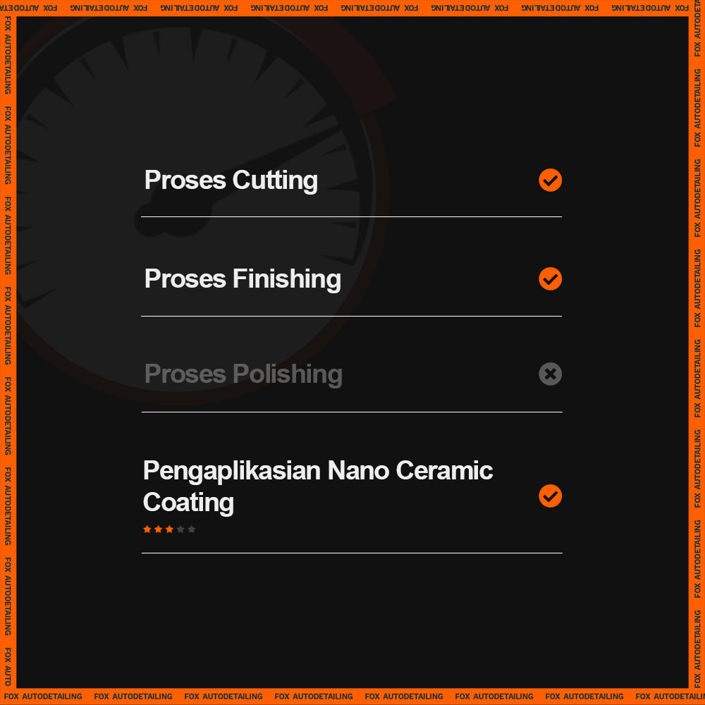

### Standar Operasional Prosedur (SOP) sebagai berikut:

### **Tahap Pertama - Pencucian**

Setiap mobil akan melalui tahap awal pencucian dan dekontaminasi seluruh panel mobil.

### **Tahap Kedua - Paint Correction (tiga macam)**

1.  **Proses Cutting:** Menghilangkan baret di panel mobil.
2.  **Proses Finishing:** Menghilangkan baret halus yang disebabkan oleh tahap sebelumnya.
3.  **Proses Polishing:** Menghilangkan baret halus yang disebabkan oleh tahap sebelumnya.

### **Tahap Ketiga - Pembersihan Keseluruhan (lima macam)**

1.  **Pembersihan debu compound** dari proses paint correction di sela-sela panel mobil.
2.  **Pembersihan panel mobil dari sisa-sisa compound** yang masih berada di panel mobil.
3.  **Pembersihan seluruh kaca mobil** ,termasuk windshield, seluruh kaca samping, dan kaca pada pintu bagasi.
4.  **Pembersihan engine bay**
5.  **Pembersihan interior**

### **Tahap Keempat - Proses Coating dan Curing**

1.  Pengaplikasian **Coating Panel Body:** Menggunakan Nano Ceramic Coating. Tingkat kekerasan berada di 9H. Bergaransi 1 tahun jika melakukan proses pemeliharaan coating dengan melakukan premium wash minimal 1 bulan sekali dengan harga Rp. 100.000, - (harga normal Rp.150.000, -).
2.  Pengaplikasian **Coating Panel Kaca:** Menggunakan _Carlack 68 Glass_ finish. Hasil dari pengaplikasian coating kaca akan memberikan efek daun talas pada kaca mobil.
3.  **Proses Curing Coating:** Proses pengeringan coating Nano Ceramic yang memerlukan waktu minimal 4 jam.  Coating _Carlack 68_ memerlukan tiga (3) jam untuk mengering. 
4.  **Proses High-end Graphene Reinforced Nano Ceramic Coating.**

### **Tahap Kelima - Finishing and Quality Control**

1.  **Pengaplikasian semir ban dan plastic trim dressing.**
2.  **Quality Control:** Pengecekan terakhir dari semua proses yang telah dilakukan sebelum mobil diberikan kepada pelanggan.

### **Harga spesial yang ditawarkan:**
> Rp. 7.500.000, _durasi pengerjaan maksimal adalah enam (6) hari kerja._

📲 [**Hubungi WhatsApp spesialis kami untuk konsultasi gratis!**](https://wa.me/628113593118)

**[Cek paket kami lainnya.](https://foxautodetailing.co.id/)**